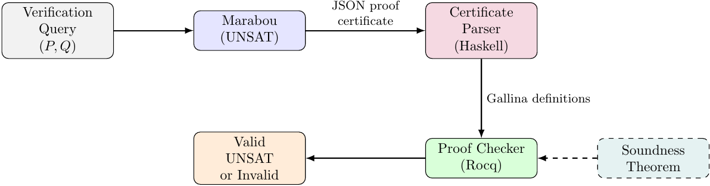

# rocq-marabou-proof-checking

This project is part of my Heriot-Watt Artificial Intelligence 2025-2026 MSc dissertation.

A certified proof checker for [Marabou](https://github.com/NeuralNetworkVerification/Marabou)
proof certificates, implemented in Rocq (formerly Coq). It reimplements the certified
proof checker developed in Imandra by Desmartin et al. ([link](https://github.com/rdesmartin/imandra-marabou-proof-checking)),
and proves in Rocq's kernel that any certificate accepted by the checker genuinely certifies
the unsatisfiability of the corresponding DNN verification query.

## How it works

When Marabou reports a verification query as UNSAT, it emits a JSON proof certificate.
The certificate parser (Haskell) translates it into Gallina definitions, which the proof
checker (Rocq) verifies. A soundness theorem, checked by Rocq's kernel, guarantees that
every accepted certificate is a valid UNSAT proof.

## Repository layout

| Path | Description |
| --- | --- |
| `parser/` | Haskell parser that converts Marabou JSON certificates into Rocq source files. |
| `proof_checker/` | Rocq proof checker and its formal soundness proof. |
| `examples/` | Sample JSON Marabou proof certificate. |
| `thesis/` | LaTeX source of the MSc dissertation. |

## Requirements

- Rocq 9.0.1
- Dune >3.19
- GHC 9.8.4
- Cabal 3.14.2.0

## Getting started

Parse the sample certificate and generate the Rocq files containing the embedded
certificate information in Gallina data types:

    cabal run parser -- --input ../examples/proof.json \
        --output ../proof_checker/src/parsed_certificate.v \
        --specs-output ../proof_checker/src/parsed_certificate_specs.v

> [!WARNING]
> Currently, the proof checker is not executable. Due to the unoptimized overuse of
> MathComp data types, it consumes too much memory and crashes before completing.

Build the proof checker (this also runs the `main.v` entry point, which computes
`is_unsat` and writes the verdict to `result.txt`):

    dune build

## Soundness proof

The theorem `check_tree_soundness` establishes that whenever the checker accepts a
certificate, the original verification query is unsatisfiable. The proof combines the
DNN Farkas lemma with split-soundness arguments, following the structure of the Imandra
development.
